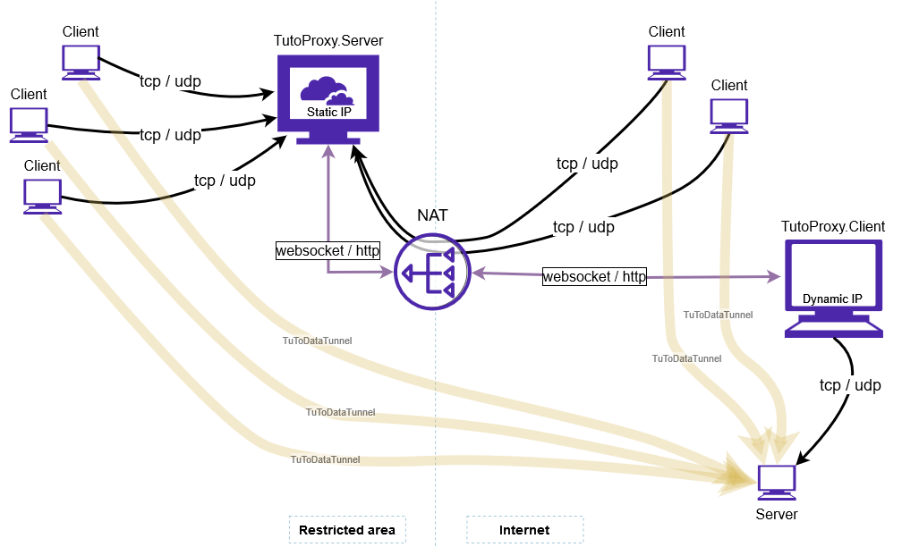

# TuToDataTunnel 
## Reverse websocket/http data tunnel on .NET + SignalR.

### Applications   

The [TutoProxy.Server](https://github.com/viordash/TuToDataTunnel/tree/main/Projects/TutoProxy/TutoProxy.Server) application is an inbound server for tunneling clients and for tcp/udp end-clients. 
cmd arguments:
- \<host\>, server address, for example http://200.100.10.1:8088
- **--tcp** \<tcp\>, list of tcp ports to listen to, for example --tcp=80,81,443,8000-8100. Optional, if --udp option is present.
- **--udp** \<udp\>, list of udp ports to listen to, for example --udp=700-900,65500. Optional, if --tcp option is present.
- **--clients** \<clients\> optional list of allowed clients, e.g. --clients=Client1,Client2 if this parameter is omitted, then there is no check for connecting client ID

For example, start input traffic tunneling on 50 tcp/udp ports to 3 clients: 

    TutoProxy.Server http://200.100.10.1:8088 --tcp=3389,8071-8073,10000-10010,20000-20010 --udp=5000-5010,7000-7010 --clients=Client0Linux,ClientSecLinux,Client3Win

The [TutoProxy.Client](https://github.com/viordash/TuToDataTunnel/tree/main/Projects/TutoProxy/TutoProxy.Client) is an output tunneling client. 
cmd arguments:
- \<server\>, TutoProxy.Server server address, for example http://200.100.10.1:8088
- \<sendto\>, the IP of the recipient of the data, for example 127.0.0.1
- **--id** \<id\>, client ID, for example --id=Client1
- **--tcp** \<tcp\>, list of tcp ports, for example --tcp=80,81,443,8000-8100. Optional, if --udp option is present.
- **--udp** \<udp\>, list of udp ports, for example --udp=700-900,65500. Optional, if --tcp option is present.

For example, start output traffic tunneling on 5 tcp and 3 udp ports: 

    TutoProxy.Client http://200.100.10.1:8088 127.0.0.1 --tcp=8071,10000,20004-20006 --udp=7000-7002 - -id=Client0Linux

*Keep in mind that ports of different TutoProxy.Clients should not overlap, i.e. each client serves a unique set of sockets/ports.*
