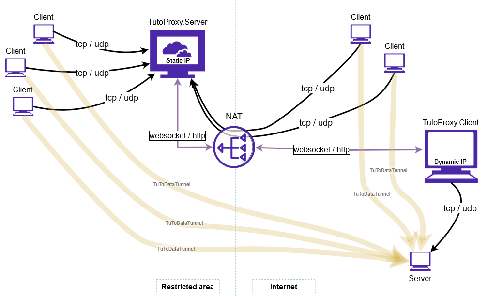

# TuToDataTunnel 
[](https://github.com/viordash/TuToDataTunnel/actions/workflows/dotnet.yml)
## Reverse websocket/http data tunnel on .NET10 + SignalR.




### Applications

#### TutoProxy.Server

[TutoProxy.Server](https://github.com/viordash/TuToDataTunnel/tree/main/Projects/TutoProxy/TutoProxy.Server) - inbound server that accepts connections from tunneling clients (TutoProxy.Client) via SignalR and listens for incoming TCP/UDP traffic from external clients.

**Command line arguments:**

| Argument | Required | Description |
|----------|----------|-------------|
| `<host>` | Yes | Server binding address with port. Example: `http://0.0.0.0:8088` or `http://200.100.10.1:8088` |
| `--tcp <ports>` | No* | TCP ports to listen on. Supports individual ports and ranges. Example: `--tcp=80,443,8000-8100` |
| `--udp <ports>` | No* | UDP ports to listen on. Supports individual ports and ranges. Example: `--udp=5000-5010,65500` |
| `--clients <list>` | No | Comma-separated list of allowed client IDs. If omitted, all clients are allowed |
| `--daemon` | No | Run in daemon mode without terminal GUI, reduces CPU overhead |

*At least one of `--tcp` or `--udp` must be specified.

**Example - start server with 50 TCP/UDP ports for 3 specific clients:**

```bash
TutoProxy.Server http://200.100.10.1:8088 \
    --tcp=3389,8071-8073,10000-10010,20000-20010 \
    --udp=5000-5010,7000-7010 \
    --clients=Client0Linux,ClientSecLinux,Client3Win
```

---

#### TutoProxy.Client

[TutoProxy.Client](https://github.com/viordash/TuToDataTunnel/tree/main/Projects/TutoProxy/TutoProxy.Client) - tunneling client that connects to TutoProxy.Server via SignalR and forwards traffic to the target host.

**Command line arguments:**

| Argument | Required | Description |
|----------|----------|-------------|
| `<server>` | Yes | TutoProxy.Server address. Example: `http://200.100.10.1:8088` |
| `<sendto>` | Yes | Target host IP where traffic will be forwarded. Example: `127.0.0.1` or `192.168.1.100` |
| `--id <id>` | Yes | Unique client identifier. Must match allowed clients on server if restriction is enabled |
| `--tcp <ports>` | No* | TCP ports to handle. Must be subset of server's TCP ports. Example: `--tcp=80,443` |
| `--udp <ports>` | No* | UDP ports to handle. Must be subset of server's UDP ports. Example: `--udp=5000-5005` |
| `--daemon` | No | Run in daemon mode without terminal GUI, reduces CPU overhead |

*At least one of `--tcp` or `--udp` must be specified.

**Example - start client forwarding 5 TCP and 3 UDP ports:**

```bash
TutoProxy.Client http://200.100.10.1:8088 127.0.0.1 \
    --tcp=8071,10000,20004-20006 \
    --udp=7000-7002 \
    --id=Client0Linux
```

**Important:** Ports of different TutoProxy.Client instances must not overlap. Each client serves a unique set of ports.

---

### Traffic Flow Architecture

#### Request Flow (External Client -> Target Host)

```
┌─────────────┐      ┌─────────────────────────────────────────────┐      ┌─────────────────────────────────────────┐       ┌─────────────┐
│  EXTERNAL   │      │               TUTOPROXY.SERVER              │      │           TUTOPROXY.CLIENT              │       │   TARGET    │
│   CLIENT    │      │                                             │      │                                         │       │    HOST     │
└──────┬──────┘      └─────────────────────────────────────────────┘      └─────────────────────────────────────────┘       └──────▲──────┘
       │                                                                                                                           │
       │  ┌──────────┐  ┌──────────┐  ┌────────────────────┐  ┌───────────┐        ┌──────────────┐  ┌──────────────┐  ┌──────────┐│
       └─►│TcpServer │─►│TcpClient │─►│DataTransferService │─►│SignalRHub │───────►│SignalRClient │─►│ClientsService│─►│TcpClient │┘
          │UdpServer │  │UdpClient │  │                    │  │           │SignalR │              │  │              │  │UdpClient │
          └──────────┘  └──────────┘  └────────────────────┘  └───────────┘        └──────────────┘  └──────────────┘  └──────────┘
```

**TutoProxy.Server side:**
1. External Client sends data to TutoProxy.Server
2. `TcpServer` / `UdpServer` receives incoming data
3. `TcpServer` / `UdpServer` passes data to `TcpClient` / `UdpClient`
4. `TcpClient` / `UdpClient` sends data via `DataTransferService` to `SignalRHub`

**TutoProxy.Client side:**
1. `SignalRClient` receives `TcpRequest` / `UdpRequest` and passes to `TcpClient` / `UdpClient`
2. `TcpClient` / `UdpClient` sends data to Target Host

#### Response Flow (Target Host -> External Client)

```
┌─────────────┐      ┌─────────────────────────────────────────────┐      ┌─────────────────────────────────────────┐       ┌─────────────┐
│  EXTERNAL   │      │               TUTOPROXY.SERVER              │      │           TUTOPROXY.CLIENT              │       │   TARGET    │
│   CLIENT    │      │                                             │      │                                         │       │    HOST     │
└──────▲──────┘      └─────────────────────────────────────────────┘      └─────────────────────────────────────────┘       └──────┬──────┘
       │                                                                                                                           │
       │  ┌──────────┐  ┌──────────┐  ┌────────────────────┐  ┌───────────┐        ┌──────────────┐                    ┌──────────┐│
       └──│TcpServer │◄─│TcpClient │◄─│DataTransferService │◄─│SignalRHub │◄───────│SignalRClient │◄───────────────────│TcpClient │┘
          │UdpServer │  │UdpClient │  │                    │  │           │SignalR │              │                    │UdpClient │
          └──────────┘  └──────────┘  └────────────────────┘  └───────────┘        └──────────────┘                    └──────────┘

```

**TutoProxy.Client side:**
1. Target Host sends response data
2. `TcpClient` / `UdpClient` receives response
3. `TcpClient` / `UdpClient` passes response to `SignalRClient` (`SendTcpResponse` / `SendUdpResponse`)
4. `SignalRClient` sends data to TutoProxy.Server

**TutoProxy.Server side:**
1. `SignalRHub` receives `TcpResponse` / `UdpResponse`
2. `DataTransferService` finds corresponding `HubClient` and passes response to it
3. `HubClient` finds `TcpServer` / `UdpServer` by port
4. `TcpServer` / `UdpServer` finds `TcpClient` / `UdpClient` by origin port
5. `TcpClient` / `UdpClient` sends response via socket to External Client

#### Component Responsibilities

**TutoProxy.Server:**
- `SignalRHub` - SignalR hub, communication with TutoProxy.Client
- `DataTransferService` - routes data between SignalRHub and HubClients
- `HubClient` - represents connected TutoProxy.Client, contains TcpServers/UdpServers
- `TcpServer` / `UdpServer` - listen on ports, manage client sessions
- `TcpClient` / `UdpClient` - handle individual external client sessions
- `HubClientsService` - manage HubClient instances, validate ports and client IDs

**TutoProxy.Client:**
- `SignalRClient` - connection to TutoProxy.Server, receives requests, sends responses
- `TcpClient` / `UdpClient` - connect to target host, forward data
- `ClientsService` - manage active connections

---

### Performance Testing

The project includes a performance testing script that measures tunnel throughput using `iperf3` and Docker.

#### Architecture

```
┌─────────────────────────────────────────────────────────────────┐
│                        localhost                                │
│                                                                 │
│  ┌─────────────┐      ┌──────────────────┐      ┌────────────┐  │
│  │ iperf3      │      │ TutoProxy.Server │      │ TutoProxy. │  │
│  │ -c localhost│─────▶│ :5201            │─────▶│ Client     │  │
│  │ -p 5201     │ TCP  │ (SignalR :5088)  │SignalR            │  │
│  └─────────────┘      └──────────────────┘      └─────┬──────┘  │
│                                                       │         │
└───────────────────────────────────────────────────────┼─────────┘
                                                        │ TCP
                                                        ▼
┌───────────────────────────────────────────────────────────────┐
│                     Docker Network                            │
│  ┌─────────────────────────────────────────────────────────┐  │
│  │  iperf3-server (172.17.0.X:5201)                        │  │
│  └─────────────────────────────────────────────────────────┘  │
└───────────────────────────────────────────────────────────────┘
```

#### Prerequisites

- Docker
- iperf3 (`sudo apt install iperf3`)
- .NET SDK

#### Usage

```bash
# Full test (baseline + tunnel)
./Projects/TutoProxy/scripts/perf-test.sh full

# Tunnel test only (10 seconds)
./Projects/TutoProxy/scripts/perf-test.sh tunnel -d 10

# Tunnel test with parallel streams
./Projects/TutoProxy/scripts/perf-test.sh tunnel -d 30 -p 4

# Baseline test only (direct to iperf3, no tunnel)
./Projects/TutoProxy/scripts/perf-test.sh baseline -d 10
```

#### VSCode Tasks

Performance tests can also be run from VSCode: `Ctrl+Shift+P` → "Tasks: Run Task" → select a perf test
